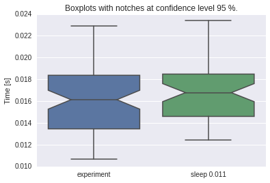

.. code:: python

    import smdc_perftests.performance_tests.test_runner as test_runner
    import time
    import numpy as np

.. code:: python

    # use measure decorator to run function multiple times
    # and measure execution time of each run
    # the returned results gets the name given in
    # the decorator but can be changed later if necessary

    @test_runner.measure('experiment', runs=50)
    def experiment(sleeptime=0.01):
        time.sleep(sleeptime+np.random.rand(1)*sleeptime)

    result1 = experiment()
    result2 = experiment(0.05)
    result2.name = "sleep 0.05"
    result3 = experiment(0.011)
    result3.name = "sleep 0.011"

    # the results can be printed
    print result1
    print result3

.. parsed-literal::

    Results experiment
    50 runs
    median 0.0158 mean 0.0157 stdev 0.0029
    sum 0.7859
    95%% confidence interval of the mean
    upper 0.0165
           |
    mean  0.0157
           |
    lower 0.0149

    Results sleep 0.011
    50 runs
    median 0.0158 mean 0.0163 stdev 0.0034
    sum 0.8168
    95%% confidence interval of the mean
    upper 0.0173
           |
    mean  0.0163
           |
    lower 0.0154

.. code:: python

    # the results can also be compared based on the 95% confidence intervals.

    print result1 < result2
    print result2 < result1
    print result1 < result3

.. parsed-literal::

    True
    False
    False

.. code:: python

    # or then plotted as boxplots
    import smdc_perftests.visual as vis
    import matplotlib.pyplot as plt
    %matplotlib inline

    fig, axis = vis.plot_boxplots(result1, result3)
    plt.show()

