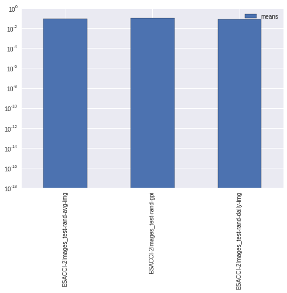

.. code:: python

    import os
    from datetime import datetime
    from smdc_perftests.performance_tests import test_scripts
    # the test_scripts module contains the function
    # run performance tests which runs all the performance tests on a dataset
    
    # in this example we will use the esa cci dataset class
    from smdc_perftests.datasets.esa_cci import ESACCI_netcdf
    from smdc_perftests import helper
.. code:: python

    #init the esa cci dataset
    fname = os.path.join("/media", "sf_H", "Development", "python", 
                         "workspace", 
                         "SMDC", "SMDC_perftests", "tests", "test_data",
                         "ESACCI-2Images.nc")
    # only read the sm variable for this testrun
    ds = ESACCI_netcdf(fname, variables=['sm'])
    # get the testname from the filename
    testname = os.path.splitext(os.path.split(fname)[1])[0]
    
    # generate a date range list using the helper function
    # in this example this does not make a lot of sense
    date_range_list = helper.generate_date_list(datetime(2013, 11, 30), 
                                                datetime(2013, 12, 1), 
                                                n=50)
    
    # set a directory into which to save the results
    # in this case the the tests folder in the home directory
    res_dir = "/home/pydev/tests/"
    # run the performance tests using the grid point indices from
    # the dataset grid, the generated date_range_list and gpi read percentage
    # of 0.1 percent and only one repeat
    test_scripts.run_performance_tests(testname, ds, res_dir, 
                                       gpi_list=ds.grid.land_ind,
                                       date_range_list=date_range_list,
                                       gpi_read_perc=0.1,
                                       repeats=1)

.. parsed-literal::

    reading 245 out of 244243 time series
    reading 1 out of 50 dates
    reading 1 out of 50 dates

This creates the following files named using the name given to the test
and the name of the test function that was run.

.. code:: python

    !ls /home/pydev/tests

.. parsed-literal::

    ESACCI-2Images_test-rand-avg-img.nc    ESACCI-2Images_test-rand-gpi.nc
    ESACCI-2Images_test-rand-daily-img.nc

Visualization of the results
~~~~~~~~~~~~~~~~~~~~~~~~~~~~

.. code:: python

    %matplotlib inline
    import glob
    import smdc_perftests.performance_tests.analyze as analyze
    
    # get all the files in the results folder
    fs = glob.glob(os.path.join(res_dir, "*.nc"))
    df = analyze.prep_results(fs)
    # this returnes the mean times at the moment
    print df
    # and makes a very simple bar plot
    ax = analyze.bar_plot(df)

.. parsed-literal::

                                           means
    ESACCI-2Images_test-rand-avg-img    0.085946
    ESACCI-2Images_test-rand-gpi        0.098265
    ESACCI-2Images_test-rand-daily-img  0.059122

