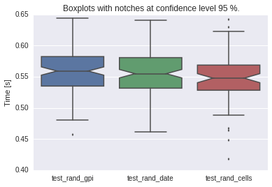

.. code:: python

    import smdc_perftests.performance_tests.test_runner as test_runner
    import time
    import datetime as dt
    import numpy as np

.. code:: python

    # define a fake Dataset class that implements the two methods
    # read_ts and read_img

    class FakeDataset(object):

        """
        Fake Dataset that provides routines for reading
        time series and images
        that do nothing
        """

        def __init__(self):
            pass

        def read_ts(self, gpi):
            time.sleep(0.01*np.random.rand(1))
            return None

        def read_img(self, date):
            """
            Image readers generally return more than one
            variable. This should not matter for these tests.
            """
            assert type(date) == dt.datetime
            time.sleep(0.01*np.random.rand(1))
            return None, None, None, None, None

.. code:: python

    fd = FakeDataset()
    # setup grid point index list, must come from grid object or
    # sciDB
    # this test dataset has 10000 gpis of which 20 percent will be read
    gpi_list = range(10000)

    @test_runner.measure('test_rand_gpi', runs=100)
    def test_ts():
        test_runner.read_rand_ts_by_gpi_list(fd, gpi_list)

    result_ts = test_ts()

    print result_ts

.. parsed-literal::

    Results test_rand_gpi
    100 runs
    median 0.0281 mean 0.0281 stdev 0.0060
    sum 2.8130
    95%% confidence interval of the mean
    upper 0.0293
           |
    mean  0.0281
           |
    lower 0.0269

.. code:: python

    # setup datetime list
    # this test dataset has 10000 days of dates of which 20 percent will be read
    date_list = []
    for days in range(10000):
        date_list.append(dt.datetime(2007, 1, 1) + dt.timedelta(days=days))

    @test_runner.measure('test_rand_date', runs=100)
    def test_img():
        test_runner.read_rand_img_by_date_list(fd, date_list)

    result_img = test_img()
    print result_img

.. parsed-literal::

    Results test_rand_date
    100 runs
    median 0.0260 mean 0.0269 stdev 0.0062
    sum 2.6858
    95%% confidence interval of the mean
    upper 0.0281
           |
    mean  0.0269
           |
    lower 0.0256

.. code:: python

    import smdc_perftests.visual as vis
    import matplotlib.pyplot as plt
    %matplotlib inline

    fig, axis = vis.plot_boxplots(result_ts, result_img)
    plt.show()

